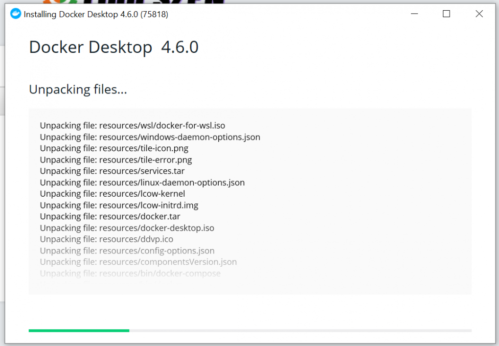
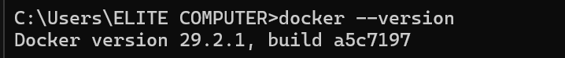

# Tp_BigData_04_Docker

> TP04: Docker pour les systèmes loT

Objectives

By the end of this lab, the student will be able to:

- Understand the concept of containerization

- Install and use Docker

- Create and manage containers

- Deploy a simple loT application with Docker

Part 1: Preparing the Environment

1. Install Docker



3. Verify the Installation


  
5. Test Docker

~~~
C:\Users\ELITE COMPUTER>docker run hello-world
Unable to find image 'hello-world:latest' locally
latest: Pulling from library/hello-world
4f55086f7dd0: Pull complete
d5e71e642bf5: Download complete
Digest: sha256:452a468a4bf985040037cb6d5392410206e47db9bf5b7278d281f94d1c2d0931
Status: Downloaded newer image for hello-world:latest

Hello from Docker!
This message shows that your installation appears to be working correctly.

To generate this message, Docker took the following steps:
 1. The Docker client contacted the Docker daemon.
 2. The Docker daemon pulled the "hello-world" image from the Docker Hub.
    (amd64)
 3. The Docker daemon created a new container from that image which runs the
    executable that produces the output you are currently reading.
 4. The Docker daemon streamed that output to the Docker client, which sent it
    to your terminal.

To try something more ambitious, you can run an Ubuntu container with:
 $ docker run -it ubuntu bash

Share images, automate workflows, and more with a free Docker ID:
 https://hub.docker.com/
~~~


Partie 2 : Questions

Quelle est la différence entre une image et un conteneur.

Image (الصورة):

هي قالب جاهز يحتوي على التطبيق وكل مكوناته (الكود + المكتبات + الإعدادات).
لا تعمل مباشرة، بل تُستخدم لإنشاء الحاويات

Container (الحاوية):

هو نسخة تعمل من الـ Image.
يمثل التطبيق أثناء التشغيل (Runtime).

Pourquoi Docker est utile en loT.
- خفيف ويعمل على الأجهزة ذات الموارد المحدودة
- يسهل نشر التطبيقات بسرعة (Deployment)
-  يضمن نفس بيئة العمل في كل الأجهزة
-  يسمح بتشغيل عدة خدمات مثل (Sensor و Server) بشكل منفصل
-  يقلل مشاكل التوافق بين الأنظمة


Quelle est la différence entre VM et conteneur .

## 🔹 الفرق بين VM و Container

| VM (آلة افتراضية)     | Container (حاوية)              |
| --------------------- | ------------------------------ |
| يحتوي نظام تشغيل كامل | يعتمد على نظام التشغيل الأساسي |
| يستهلك موارد كبيرة    | خفيف وسريع                     |
| وقت تشغيل بطيء        | تشغيل سريع                     |
| يحتاج RAM كبير        | يستهلك RAM أقل                 |


Que fait la commande docker build.

🔹 يقوم بـ:

- Dockerfileقراءة ملف 
- جديدةImageإنشاء  
- تجهيز التطبيق ليعمل داخل حاوية


Explique le rôle de MQTT dans loT.

MQTT هو بروتوكول اتصال خفيف مخصص لإنترنت الأشياء.

###   طريقة العمل:

يعتمد على نظام:

* **Publisher (المرسل)**
* **Subscriber (المستقبل)**

###  مثال:

* **Sensor** يرسل البيانات (Publisher)
* **Server** يستقبل البيانات (Subscriber)

###  مميزاته:

* سريع وخفيف
* مناسب للأجهزة ذات الطاقة المحدودة
* يعمل بكفاءة في الشبكات الضعيفة


Partie 3:Docker Hub

- Create an account in Docker Hub.


* اذهب إلى: https://hub.docker.com
* أنشئ حساب جديد
* قم بتسجيل الدخول:

```bash
docker login
```

---

- Create an image of TP 3.

📁 أنشئ ملف `Dockerfile`:

```Dockerfile
FROM python:3.9
WORKDIR /app
COPY . .
RUN pip install paho-mqtt
CMD ["python", "app.py"]
```

---

- Save this image to Docker Hub.

```bash
docker build -t sofiane2003 .
```

---

uploade image in docker Hub

```bash
docker push sofiane2003
```

---

- Download the Docker image uploaded to Docker Hub.
Mini-project

```bash
docker pull sofiane2003
```

---

#  Mini Project: IoT avec Docker

##  Objective

Create:

* Container 1: Sensor (يرسل البيانات)
* Container 2: Server (يستقبل البيانات)
* Container 3: MQTT Broker (وسيط الاتصال)

---

##  1. Create Sensor

📄 `sensor.py`

```python
import paho.mqtt.client as mqtt
import time

client = mqtt.Client()
client.connect("broker", 1883)

while True:
    client.publish("iot/data", "Temperature: 25C")
    print("Data sent")
    time.sleep(2)
```

---

##  2. Create Server

📄 `server.py`

```python
import paho.mqtt.client as mqtt

def on_message(client, userdata, msg):
    print("Received:", msg.payload.decode())

client = mqtt.Client()
client.on_message = on_message

client.connect("broker", 1883)
client.subscribe("iot/data")

client.loop_forever()
```

---

##  3. Dockerfile (لكل من sensor و server)

```Dockerfile
FROM python:3.9
WORKDIR /app
COPY . .
RUN pip install paho-mqtt
```

in server :

```Dockerfile
CMD ["python", "sensor.py"]
```

in Server: 

```Dockerfile
CMD ["python", "server.py"]
```

---

##  4. docker-compose.yml

```yaml
version: '3'

services:
  broker:
    image: eclipse-mosquitto
    ports:
      - "1883:1883"

  sensor:
    build: ./sensor
    depends_on:
      - broker

  server:
    build: ./server
    depends_on:
      - broker
```

---

Run Project

```bash
docker-compose up --build
```

---

Verify that the three containers are running correctlyby running the command :

```bash
docker ps
```

Rusolt:

* broker
* sensor
* server

---

Note :
Commend:

```bash
docker run -p 1883:1883 eclipse-mosquitto
```

🔹 يعني:

* ربط port في الجهاز (Host) مع port داخل الحاوية (Container)

---

## Result :

* Sensor يرسل البيانات عبر MQTT
* Broker ينقل البيانات
* Server يستقبل البيانات ويعرضها

---
